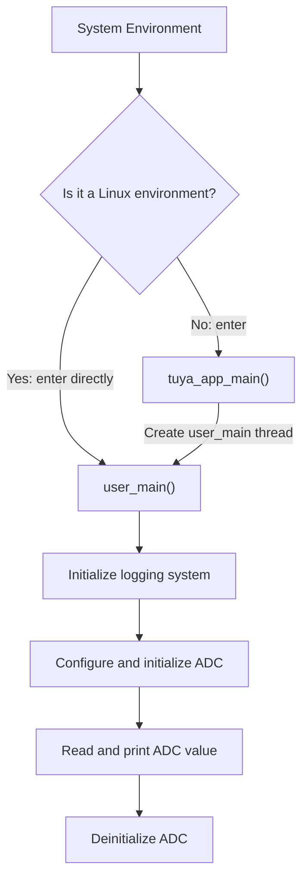

# ADC

ADC (Analog-to-Digital Converter) is a device that converts **continuous analog signals** into **discrete digital signals**. Through sampling and quantization, it converts analog voltage values into digital codes. ADC is widely used in sensor data acquisition, battery voltage monitoring, audio processing, and more. Key performance metrics of ADC include resolution, sampling rate, accuracy, and linearity.

This example demonstrates how to perform a single ADC data acquisition. For detailed ADC API documentation, please refer to: [TKL_ADC](https://www.tuyaopen.ai/zh/docs/tkl-api/tkl_adc).

## User Guide

### Prerequisites

Since each development platform has different resources, not all peripherals are supported.
Before compiling and running this example, check whether ADC is enabled by default in `board/<target platform, e.g. T5AI>/TKL_Kconfig`:

```shell
config ENABLE_ADC
    bool
    default y
```

Make sure the basic [environment setup](https://www.tuyaopen.ai/zh/docs/quick-start/enviroment-setup) has been completed before running this example.

- **Hardware Configuration**

  ADC port, channel, mode, and other configurations are defined as macros at the top of the source file (`examples/peripherals/adc/src/example_adc.c`). Modify them directly in the source file if needed.

  ```c
  /***********************************************************
  *************************micro define***********************
  ***********************************************************/
  #define EXAMPLE_ADC_PORT             TUYA_ADC_NUM_0
  #define EXAMPLE_ADC_CHANNEL          2
  #define EXAMPLE_ADC_MODE             TUYA_ADC_CONTINUOUS
  #define EXAMPLE_ADC_TYPE             TUYA_ADC_INNER_SAMPLE_VOL
  ```

- **Hardware Connection**

  Connect the ADC sensing pin to the pin under test according to the peripheral configuration. For example, if using the default settings, connect the ADC2 pin to a high-level signal.

- **Pin Mapping Reference**

  ADC channel-to-GPIO pin mappings differ across development platforms. Please refer to the corresponding documentation for your platform:

  - **ESP32 Series**: See [ESP32 GPIO & RTC GPIO](https://docs.espressif.com/projects/esp-idf/en/v5.5.2/esp32/api-reference/peripherals/gpio.html) for pin functions and ADC channel mapping information for each chip.
  > ESP32 series ADC1 corresponds to TUYA_ADC_NUM_0, ADC2 corresponds to TUYA_ADC_NUM_1.
  - **T3 Series**

    ADC channels on the T3 platform have fixed GPIO pin mappings as follows:

    | ADC Channel | GPIO Pin |
    |---|---|
    | ADC_1 | GPIO 25 |
    | ADC_2 | GPIO 24 |
    | ADC_4 | GPIO 28 |
    | ADC_12 | GPIO 0 |
    | ADC_13 | GPIO 1 |
    | ADC_14 | GPIO 12 |
    | ADC_15 | GPIO 13 |

  - **T5 Series**: See [T5AI Peripheral Pin Mapping](https://tuyaopen.ai/docs/hardware-specific/tuya-t5/t5ai-peripheral-mapping) for ADC channel-to-pin mappings on the T5AI platform.

### Select Project Configuration File

Before compiling the example, select the configuration file corresponding to your target development platform.

- Navigate to this example directory (assuming you are in the TuyaOpen repository root):

  ```shell
  cd examples/peripherals/adc
  ```

- Open the configuration file selection menu:

  ```shell
  tos.py config choice
  ```

  After execution, the terminal will display a menu similar to:

  ```
  --------------------
  1. BK7231X.config
  2. ESP32-C3.config
  3. ESP32-S3.config
  4. ESP32.config
  5. EWT103-W15.config
  6. LN882H.config
  7. T2.config
  8. T3.config
  9. T5AI.config
  10. Ubuntu.config
  --------------------
  Input "q" to exit.
  Choice config file:
  ```

- Enter the number corresponding to your target platform and press Enter. For example, to select T5AI, enter "9" and press Enter:

  ```shell
  Choice config file: 9
  [INFO]: Initialing using.config ...
  [NOTE]: Choice config: /home/share/samba/TuyaOpen/boards/T5AI/config/T5AI.config
  ```

### Run Preparation

- **Parameter Configuration**

  ADC port, channel, mode, and other configurations are defined as macros at the top of the source file (`./src/example_adc.c`). Modify them directly in the source file if needed.

  ```c
  /***********************************************************
  *************************micro define***********************
  ***********************************************************/
  #define EXAMPLE_ADC_PORT             TUYA_ADC_NUM_0
  #define EXAMPLE_ADC_CHANNEL          2
  #define EXAMPLE_ADC_MODE             TUYA_ADC_CONTINUOUS
  #define EXAMPLE_ADC_TYPE             TUYA_ADC_INNER_SAMPLE_VOL
  ```

- **Hardware Connection**

  Connect the ADC sensing pin to the pin under test according to the peripheral configuration. For example, if using the default settings, connect the ADC2 pin to a high-level signal.

### Build and Flash

- To build the project, run:

  ```
  tos.py build
  ```

  On successful build, the terminal will display output similar to:

  ```
  [NOTE]:
  ====================[ BUILD SUCCESS ]===================
   Target    : adc_QIO_1.0.0.bin
   Output    : /home/share/samba/TuyaOpen/examples/peripherals/adc/dist/adc_1.0.0
   Platform  : T5AI
   Chip      : T5AI
   Board     : TUYA_T5AI_BOARD
   Framework : base
  ========================================================
  ```

- To flash the firmware, run:

  ```
  tos.py flash
  ```

### Execution Results

- To view the logs, run:

  ```
  tos.py monitor
  ```

  If you encounter issues with flashing or viewing logs, please read [Flashing and Logging](https://www.tuyaopen.ai/docs/quick-start/firmware-burning).

- The terminal will print the collected ADC value, for example:

  ```
  [01-01 00:01:34 TUYA D][lr:0x70309] ADC0 value = 4049
  ```

## Example Description

### Flowchart



### Process Description

1. System initialization: In a Linux environment, `user_main()` is called directly. In other environments, `tuya_app_main()` creates a `user_main()` thread.
2. Call `tal_log_init()` to initialize the logging system.
3. Call `tkl_adc_init()` to initialize ADC.
4. Perform a single read of the ADC raw value and print it.
5. Call `tkl_adc_deinit()` to deinitialize ADC.

## Technical Support

You can obtain support from Tuya through the following methods:

- TuyaOpen: https://www.tuyaopen.ai

- GitHub: https://github.com/tuya/TuyaOpen