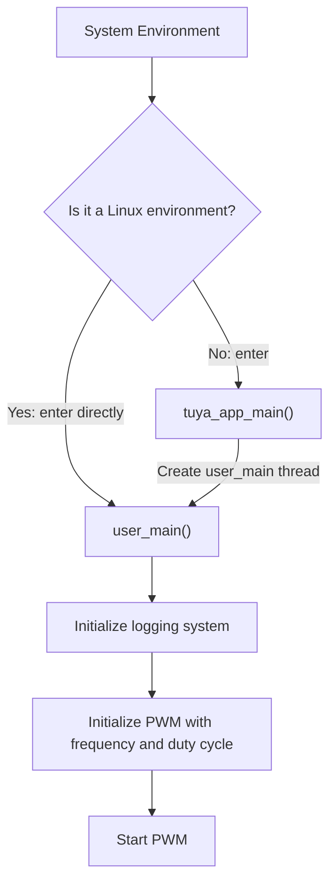

# PWM

PWM (Pulse Width Modulation) is a digital technique that controls analog circuits by **varying the duty cycle of a pulse signal**. A PWM signal consists of periodic square waves. By adjusting the ratio of high-level time to the total period (duty cycle), it can effectively output different analog voltage levels.

This example demonstrates how to use the PWM interface to output periodic square waves. For detailed PWM API documentation, please refer to: [TKL_PWM](https://www.tuyaopen.ai/zh/docs/tkl-api/tkl_pwm).

## User Guide

### Prerequisites

Since each development platform has different resources, not all peripherals are supported.
Before compiling and running this example, check whether PWM is enabled by default in `board/<target platform, e.g. T5AI>/TKL_Kconfig`:

```
config ENABLE_PWM
    bool
    default y
```

Make sure the basic [environment setup](https://www.tuyaopen.ai/zh/docs/quick-start/enviroment-setup) has been completed before running this example.

- **Pin Mapping Reference**

  PWM channel-to-GPIO pin mappings differ across development platforms. Please refer to the following instructions based on your platform:

  - **ESP32 Series**

    The PWM implementation on the ESP32 platform is based on the LEDC peripheral and supports remapping PWM channels to any available GPIO pin via `tkl_io_pinmux_config()`. The default PWM channel-to-GPIO mappings are:

    | PWM Channel | Default GPIO |
    |---|---|
    | `TUYA_PWM_NUM_0` | GPIO 18 |
    | `TUYA_PWM_NUM_1` | GPIO 19 |
    | `TUYA_PWM_NUM_2` | GPIO 22 |
    | `TUYA_PWM_NUM_3` | GPIO 23 |
    | `TUYA_PWM_NUM_4` | GPIO 25 |
    | `TUYA_PWM_NUM_5` | GPIO 26 |

    To use a different GPIO pin for PWM output, call `tkl_io_pinmux_config()` **before** `tkl_pwm_init()`. For example, to map GPIO 4 to PWM channel 0:

    ```c
    // Remap GPIO 4 to PWM channel 0
    tkl_io_pinmux_config(TUYA_IO_PIN_4, TUYA_PWM0);
    ```

    > For available GPIO pin information on each ESP32 chip, see [ESP32 GPIO & RTC GPIO](https://docs.espressif.com/projects/esp-idf/zh_CN/v5.5.2/esp32/api-reference/peripherals/gpio.html).

  - **T3 Series**

    PWM channels on the T3 platform have fixed hardware PWM ID mappings and do not support pin remapping. The mappings are as follows:

    | TKL PWM Channel | BK PWM ID |
    |---|---|
    | `TUYA_PWM_NUM_0` | PWM_ID_0 |
    | `TUYA_PWM_NUM_1` | PWM_ID_4 |
    | `TUYA_PWM_NUM_2` | PWM_ID_6 |
    | `TUYA_PWM_NUM_3` | PWM_ID_8 |
    | `TUYA_PWM_NUM_4` | PWM_ID_10 |

    > For the actual GPIO pins corresponding to each PWM ID, please refer to the pin multiplexing table in the T3 chip datasheet.

  - **T5 Series**

    PWM channels on the T5 platform have **fixed pin mappings** and cannot be remapped via `tkl_io_pinmux_config()`. See [T5AI Peripheral Pin Mapping](https://tuyaopen.ai/zh/docs/hardware-specific/tuya-t5/t5ai-peripheral-mapping) for PWM channel-to-pin mappings, and select the correct PWM channel according to the documentation.

### Select Project Configuration File

Before compiling the example, select the configuration file corresponding to your target development platform.

- Navigate to this example directory (assuming you are in the TuyaOpen repository root):

  ```shell
  cd examples/peripherals/pwm
  ```

- Open the configuration file selection menu:

  ```shell
  tos.py config choice
  ```

  After execution, the terminal will display a menu similar to:

  ```
  --------------------
  1. BK7231X.config
  2. ESP32-C3.config
  3. ESP32-S3.config
  4. ESP32.config
  5. EWT103-W15.config
  6. LN882H.config
  7. T2.config
  8. T3.config
  9. T5AI.config
  10. Ubuntu.config
  --------------------
  Input "q" to exit.
  Choice config file:
  ```

- Enter the number corresponding to your target platform and press Enter. For example, to select T5AI, enter "9" and press Enter:

  ```shell
  Choice config file: 9
  [INFO]: Initialing using.config ...
  [NOTE]: Choice config: /home/share/samba/TuyaOpen/boards/T5AI/config/T5AI.config
  ```

### Run Preparation

- **Parameter Configuration**

  PWM channel, pin configuration, frequency, duty cycle, and other parameters can be configured via Kconfig (configuration file path: `./Kconfig`).

  - To open the Kconfig configuration menu, run:

    ```
    tos.py config menu
    ```

    After execution, the terminal will display a menu similar to:

    ```
    configure project  --->
    Application config  --->
    Choice a board (T5AI)  --->
    configure tuyaopen  --->
    ```

  - Use the up/down arrow keys to select the submenu, choose **Application config** and press Enter.

    The application configuration menu will display:

    ```shell
    (0) pwm port
    (5000) pwm duty
    (10000) pwm frequency
    ```

    Default parameters are provided. To modify a setting, use the arrow keys to select it, press Enter to edit, and press Q then Y to save and exit.

- **Hardware Connection**

  Connect the configured PWM output pin to a logic analyzer or oscilloscope to observe the square wave output.

### Build and Flash

- To build the project, run:

  ```
  tos.py build
  ```

  On successful build, the terminal will display output similar to:

  ```
  [NOTE]:
  ====================[ BUILD SUCCESS ]===================
   Target    : pwm_QIO_1.0.0.bin
   Output    : /home/share/samba/TuyaOpen/examples/peripherals/pwm/dist/pwm_1.0.0
   Platform  : T5AI
   Chip      : T5AI
   Board     : TUYA_T5AI_BOARD
   Framework : base
  ========================================================
  ```

- To flash the firmware, run:

  ```
  tos.py flash
  ```

### Execution Results

- To view the logs, run:

  ```shell
  tos.py monitor
  ```

  If you encounter issues with flashing or viewing logs, please read [Flashing and Logging](https://www.tuyaopen.ai/zh/docs/quick-start/firmware-burning).

- After PWM starts successfully, a log similar to the following will be printed:

  ```
  [01-01 00:00:00 TUYA I][example_pwm.c:xx] PWM: 0 Frequency: 10000 start
  ```

  If the PWM port is connected to a logic analyzer, a waveform similar to the following can be observed:


## Example Description

### Flowchart



### Process Description

1. System initialization: In a Linux environment, `user_main()` is called directly. In other environments, `tuya_app_main()` creates a `user_main()` thread.
2. Call `tal_log_init()` to initialize the logging system.
3. Configure PWM output pin mapping.
4. Set the PWM base frequency and duty cycle, then initialize.
5. Start PWM.

## Technical Support

You can obtain support from Tuya through the following methods:

- TuyaOpen: https://www.tuyaopen.ai/zh

- GitHub: https://github.com/tuya/TuyaOpen
