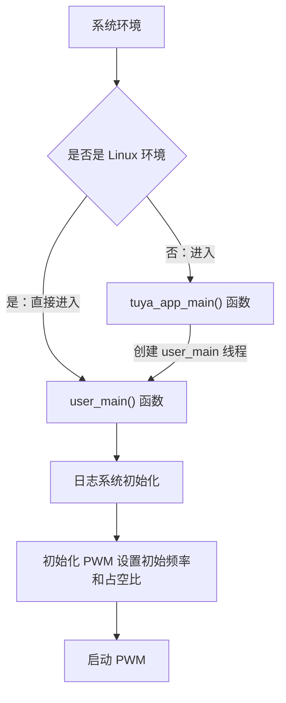

PWM（Pulse Width Modulation）即脉冲宽度调制，是一种通过**改变脉冲信号的占空比**来控制模拟电路的数字技术。PWM 信号由周期性的方波组成，通过调节高电平时间与整个周期时间的比值（占空比），可以等效地输出不同的模拟电压值。

本示例的代码主要向您演示如何使用 PWM 接口输出周期性方波。关于 PWM 接口的详细说明请查看: [TKL_PWM](https://www.tuyaopen.ai/zh/docs/tkl-api/tkl_pwm)。

## 使用指导

### 前置条件

由于每个开发平台上的资源不一样，并不会支持所有外设。
在编译运行该示例代码前，您需要检查 `board/<目标开发平台，如 T5AI>/TKL_Kconfig` 中确认使能配置是否默认打开：

```
config ENABLE_PWM
    bool
    default y
```

在运行本示例工程前要确认基础的 [环境搭建](https://www.tuyaopen.ai/zh/docs/quick-start/enviroment-setup) 已经完成。

- **管脚映射参考**

  不同开发平台的 PWM 通道与 GPIO 管脚映射关系不同，请根据您使用的平台查阅以下说明：

  - **ESP32 系列**

    ESP32 平台的 PWM 基于 LEDC 外设实现，支持通过 `tkl_io_pinmux_config()` 将 PWM 通道重新映射到任意可用的 GPIO 管脚。默认的 PWM 通道与 GPIO 映射关系如下：

    | PWM 通道 | 默认 GPIO |
    |---|---|
    | `TUYA_PWM_NUM_0` | GPIO 18 |
    | `TUYA_PWM_NUM_1` | GPIO 19 |
    | `TUYA_PWM_NUM_2` | GPIO 22 |
    | `TUYA_PWM_NUM_3` | GPIO 23 |
    | `TUYA_PWM_NUM_4` | GPIO 25 |
    | `TUYA_PWM_NUM_5` | GPIO 26 |

    如果需要使用其他 GPIO 管脚输出 PWM，可以在调用 `tkl_pwm_init()` **之前**，使用 `tkl_io_pinmux_config()` 进行管脚重映射。例如，将 GPIO 4 映射为 PWM 通道 0：

    ```c
    // 将 GPIO 4 重映射到 PWM 通道 0
    tkl_io_pinmux_config(TUYA_IO_PIN_4, TUYA_PWM0);
    ```

    > 关于 ESP32 各芯片可用的 GPIO 管脚信息，请参考 [ESP32 GPIO & RTC GPIO](https://docs.espressif.com/projects/esp-idf/zh_CN/v5.5.2/esp32/api-reference/peripherals/gpio.html)。

  - **T3 系列**

    T3 平台的 PWM 通道与硬件 PWM ID 为固定映射，不支持管脚重映射。对应关系如下：

    | TKL PWM 通道 | BK PWM ID |
    |---|---|
    | `TUYA_PWM_NUM_0` | PWM_ID_0 |
    | `TUYA_PWM_NUM_1` | PWM_ID_4 |
    | `TUYA_PWM_NUM_2` | PWM_ID_6 |
    | `TUYA_PWM_NUM_3` | PWM_ID_8 |
    | `TUYA_PWM_NUM_4` | PWM_ID_10 |

    > 各 PWM ID 对应的实际 GPIO 管脚请参考 T3 芯片数据手册中的管脚复用表。

  - **T5 系列**

    T5 平台的 PWM 通道与管脚为**固定映射**，不支持通过 `tkl_io_pinmux_config()` 重新映射。请参考 [T5AI 外设管脚映射](https://tuyaopen.ai/zh/docs/hardware-specific/tuya-t5/t5ai-peripheral-mapping) 获取 T5AI 平台的 PWM 通道与管脚对应关系，并根据文档选择正确的 PWM 通道。

### 选择配置文件

在编译示例工程之前需要根据自己的目标开发平台选择对应的配置文件。

- 进入本示例工程目录（假设当前路径是在 TuyaOpen 仓库的根目录下）, 请执行以下命令：

  ```shell
  cd examples/peripherals/pwm
  ```

- 进入选择配置文件的菜单，请执行以下命令：

  ```shell
  tos.py config choice
  ```

  命令执行完成后，终端会显示类似以下界面：

  ```
  --------------------
  1. BK7231X.config
  2. ESP32-C3.config
  3. ESP32-S3.config
  4. ESP32.config
  5. EWT103-W15.config
  6. LN882H.config
  7. T2.config
  8. T3.config
  9. T5AI.config
  10. Ubuntu.config
  --------------------
  Input "q" to exit.
  Choice config file: 
  ```

- 根据目标开发平台输入对应配置文件的编号然后按回车键。如选择 T5AI 平台，请输入数字 "9" 后回车键，终端会显示以下界面：

  ```shell
  Choice config file: 9
  [INFO]: Initialing using.config ...
  [NOTE]: Choice config: /home/share/samba/TuyaOpen/boards/T5AI/config/T5AI.config
  ```

### 运行准备

- **参数配置**

  PWM 的通道，引脚配置，频率，占空比等参数可通过 Kconfig (配置文件路径：./Kconfig)配置。

  - 进入 Kconfig 配置菜单界面， 请执行以下命令：

    ```
    tos.py config menu
    ```

    命令执行完成后，终端会显示类似以下界面：

    ```
    configure project  --->
    Application config  --->
    Choice a board (T5AI)  --->
    configure tuyaopen  --->
    ```

  - 按上下方向键选择子菜单，选择应用配置子菜单 ( Application config ) 按回车键进入。

    进入应用配置的菜单后，终端会显示类似以下界面：

    ```shell
    (0) pwm port
    (5000) pwm duty
    (10000) pwm frequency
    ```
    
    工程会给定一个默认参数，如果您想修改配置可以按上下键选修改项，选定后按回车键可进行修改，修改完成后按Q键和Y键保存退出。
  
- **硬件连接**

  将上述配置的 PWM 端口接在逻辑分析仪上或者示波器上观察是否有方波输出。

### 编译烧录

- 编译工程，请执行以下指令：

  ```
  tos.py build
  ```

  工程编译成功后，终端会出现类似以下界面:

  ```
  [NOTE]: 
  ====================[ BUILD SUCCESS ]===================
   Target    : pwm_QIO_1.0.0.bin
   Output    : /home/share/samba/TuyaOpen/examples/peripherals/pwm/dist/pwm_1.0.0
   Platform  : T5AI
   Chip      : T5AI
   Board     : TUYA_T5AI_BOARD
   Framework : base
  ========================================================
  ```

- 烧录固件，请执行以下指令：

  ```
  tos.py flash
  ```

### 运行结果

- 查看日志，请执行以下指令：

  ```shell
  tos.py monitor
  ```

​	如果烧录和查看日志的步骤出现问题，请阅读 [烧录和日志](https://www.tuyaopen.ai/zh/docs/quick-start/firmware-burning) 。

- PWM 正常启动后，会打印类似如下日志：

  ```
  [01-01 00:00:00 TUYA I][example_pwm.c:xx] PWM: 0 Frequency: 10000 start
  ```
  

​	如果 PWM 端口接上了逻辑分析仪可看见类似如下波形：


## 示例说明

### 流程图



### 流程说明

1. 系统初始化：如果是 Linux 环境，直接调用 user_main()。其他环境则进入 tuya_app_main() 创建 user_main() 线程。
2. 调用 tal_log_init() 初始化日志系统。
3. 配置 PWM 输出引脚的映射关系。
4. 设置 PWM 的基础频率和占空比并初始化。
5. 启动 PWM。

## 技术支持

您可以通过以下方法获得涂鸦的支持:

- TuyaOpen：https://www.tuyaopen.ai/zh

- GitHub：https://github.com/tuya/TuyaOpen